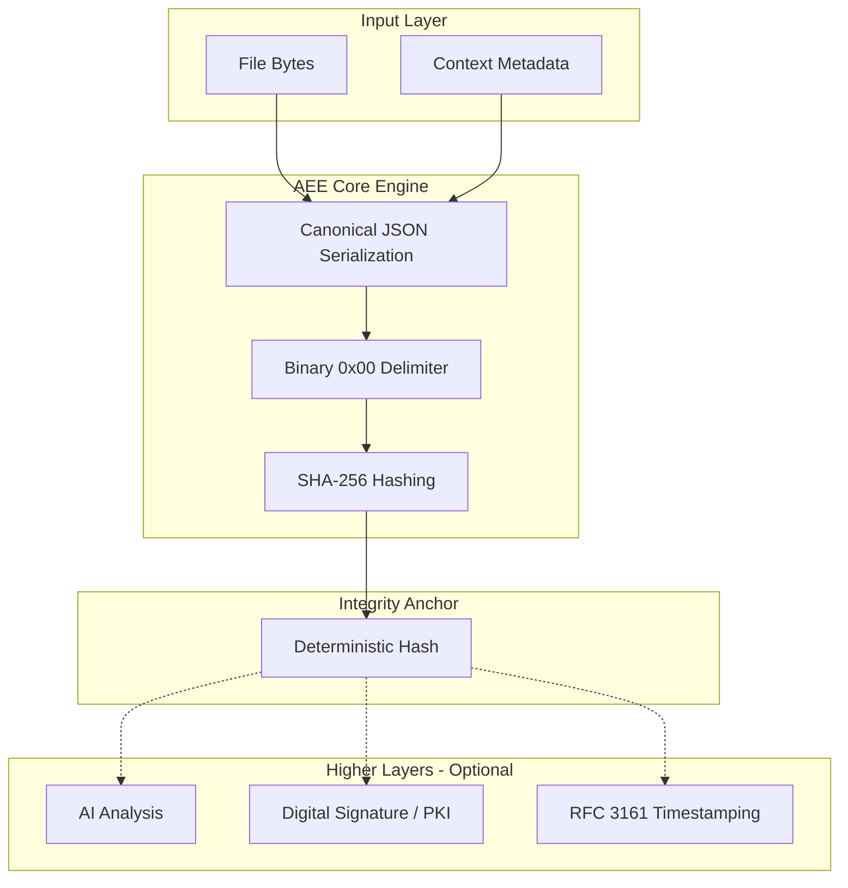

# Architecture Overview – AEE Protocol
### Deterministic Integrity Primitive

**Status:** Stable  
**Version:** 1.2.0  
**Audience:** Software Architects, Security Engineers, Auditors

---

## 1. Purpose

AEE is a **deterministic integrity primitive**.

It is designed to produce reproducible integrity anchors that bind:
- Binary content
- Contextual metadata
- Deterministic execution rules

AEE is not a system, platform, or certification authority.
It is a composable building block.

---

## 2. Design Philosophy

Modern systems increasingly rely on probabilistic components (LLMs, ML pipelines).
These systems require a **deterministic boundary** at their input.

AEE provides that boundary.

> Determinism first. Everything else is layered on top.

---

## 3. High-Level Architecture

[ Metadata ] [ File Bytes ]
| |
+---- Canonical ---+
|
[ 0x00 Delimiter ]
|
[ SHA-256 ]
|
[ Integrity Anchor ]

---

## 4. Core Properties

### Determinism
Same input → same output across platforms.

### Transparency
No hidden state, no automation, no network calls.

### Auditability
The process can be reproduced manually by any third party.

---

## 5. Non-Goals

AEE explicitly does not provide:
- Identity verification
- Legal certification
- Timestamping
- Post-quantum security
- Content validation

These concerns are external layers.

---

## 6. Composition Model

AEE is designed to be composed with:
- PKI / Digital Signatures
- Timestamping Authorities (RFC 3161)
- Forensic Chain-of-Custody systems
- AI analysis pipelines

This separation is intentional.

---

## 7. Architectural Stability

The core hashing pipeline is considered stable.
Future versions may add layers, but the primitive remains unchanged.

---

## 8. Conclusion

AEE is infrastructure, not a claim.

Its value comes from **precision, restraint, and determinism**.

---

## Architecture Flow Diagram

